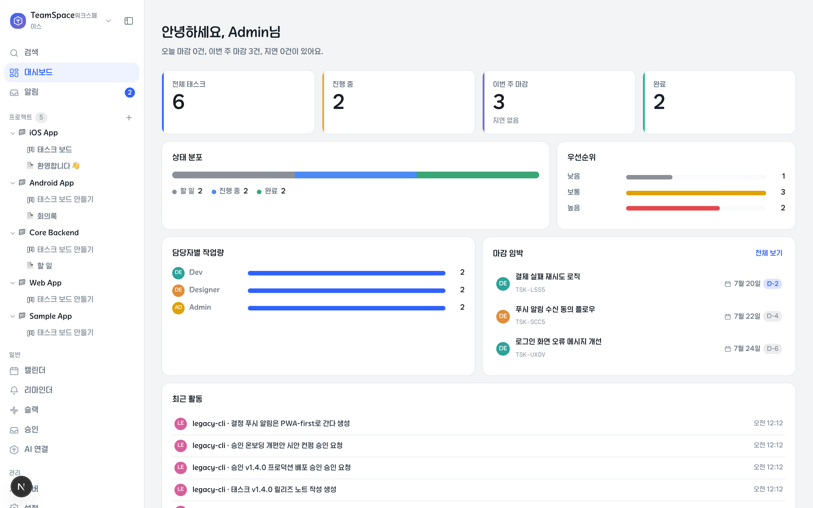
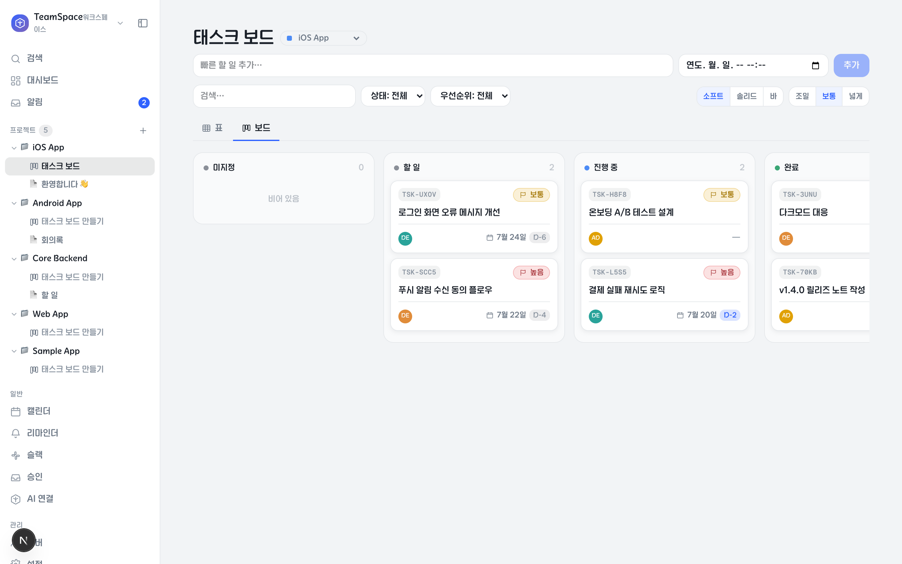
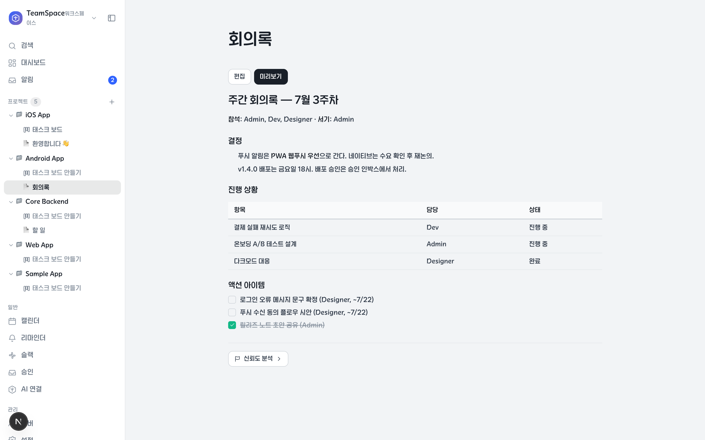
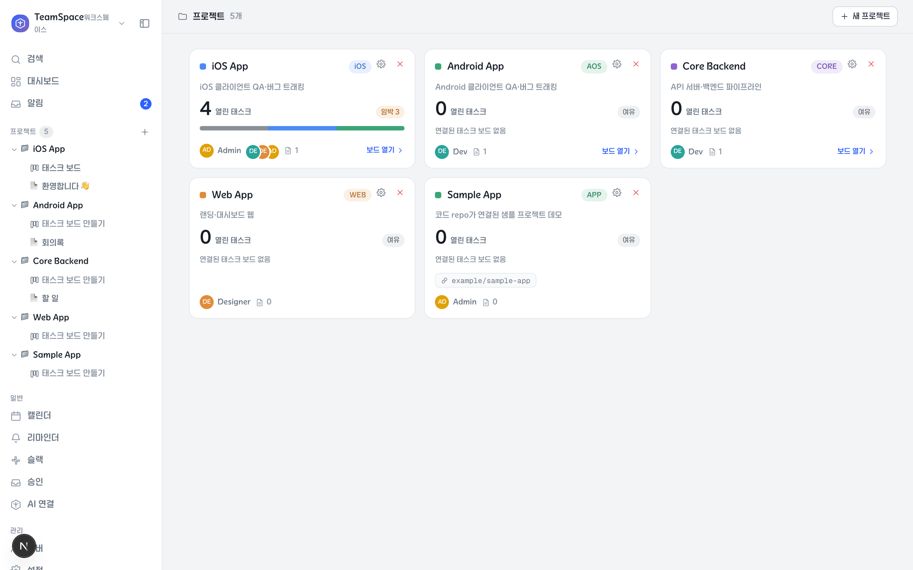
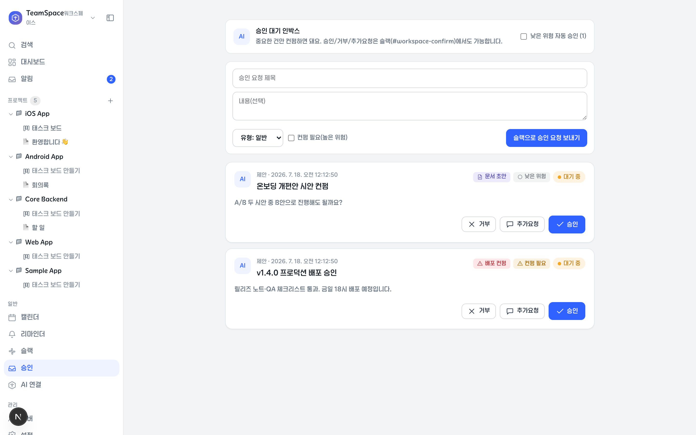

# TeamSpace

**사람 + Claude 에이전트 혼성 팀을 위한 셀프호스팅 워크스페이스.** 프로젝트 · 칸반 태스크 보드 · 문서 · 결정/리스크/용어 · 승인 · 레슨 · 알림 인박스 · 활동 피드를 하나의 앱에서 다루고, 모든 조작이 HTTP API로 열려 있어 **에이전트가 일급 팀원으로 참여**한다.

문서는 file-first다 — 본문이 DB가 아니라 데이터 디렉토리(`TEAMSPACE_DATA_DIR`) 아래 파일 + git 저장소로 남아 레포와 분리 백업·이관이 쉽다. Slack 연동을 켜면 "진행 방향을 가르는 결정"을 채널로 보내 버튼/답글로 승인받는 컨펌 루프가 동작하고, 동봉된 MCP 서버·`pnpm ws` CLI·Claude Code 훅/스킬로 에이전트 세션마다 팀 컨텍스트(레슨·태스크·결정)가 자동 주입된다.

Slack·LLM·Google OAuth 는 전부 선택이다. 없어도 코어(보드·문서·결정·승인)는 그대로 동작한다.

- 스택: Next.js(App Router) + Prisma + Postgres(docker)
- 라이선스: MIT

## 화면

**대시보드** — 마감·상태 분포·담당자별 작업량·최근 활동을 한눈에.



**태스크 보드** — 프로젝트별 칸반/표 이중 뷰, 빠른 추가·검색·필터.



**문서** — 프로젝트 아래 file-first 문서. 본문은 데이터 디렉토리의 md 파일 + git 이력으로 남는다.



**프로젝트** — 열린 태스크·임박 마감·참여자·연결 레포까지 프로젝트 카드로.



**승인 인박스** — 에이전트·팀원이 올린 결정을 버튼으로 승인/거부/추가요청. Slack 연동 시 채널 카드로도 처리 가능.



## 빠른 시작

```bash
docker compose up -d postgres        # postgres (호스트 5433 포트)
cp .env.example .env                 # AUTH_SECRET 채우기: openssl rand -base64 33
pnpm install
pnpm exec prisma migrate deploy
pnpm db:seed                         # 첫 워크스페이스 + admin@example.com 시드
pnpm dev                             # http://localhost:3000
```

포트 메모: 프로덕션·CLI·MCP 의 기본 대상은 `http://localhost:3002` 다. 개발 서버를 CLI/MCP 와 같이 쓰려면 `pnpm dev -p 3002` 로 띄우거나 `WS_BASE=http://localhost:3000` 을 설정한다.

로그인 없이 바로 둘러보려면 `.env` 에 `AUTH_OPEN_API=true`(데모 전용, 아래 참조).

상태 확인: `curl localhost:3002/api/health` → `{ok, db, worker}`

## 데이터 디렉토리

문서 md 파일(`docs/`) · 본문 git 저장소(`content/`) · 업로드(`uploads/`)는 레포가 아니라 데이터 디렉토리에 저장된다. 기본값은 `<레포 루트>/data`, `TEAMSPACE_DATA_DIR` 로 바꿀 수 있다.

백업은 `pnpm backup` — Postgres 덤프 + 데이터 디렉토리 tar 를 `TEAMSPACE_BACKUP_DIR`(기본 `~/Backups/teamspace`)에 저장하고 최근 14개를 로테이션한다.

**복원 리허설** — 백업은 복원해 봐야 믿을 수 있다. `pnpm restore:rehearsal [백업 디렉토리] [--keep]`(`scripts/restore-rehearsal.sh`)이 최신(또는 지정) 백업을 스크래치 DB `teamspace_rehearsal_<타임스탬프>` 에 복원해 7가지(필수 파일·`pg_restore`·마이그레이션 일치·핵심 테이블 행 수·문서 파일 표본·첨부 아카이브·정리)를 점검하고 `결과: PASS|FAIL`(FAIL 이면 종료 코드 1)을 출력한다. 운영 DB 는 읽기만 한다. 분기에 한 번 돌리고 결과를 문서로 남긴다:

```bash
pnpm restore:rehearsal | tee /tmp/rehearsal.txt
pnpm ws rehearsal record /tmp/rehearsal.txt   # 결과 블록 → 문서 "백업 복원 리허설 <YYYY-MM-DD>" 생성
```

워커가 1·4·7·10월 첫 월요일에 관리자 받은편지함으로 `분기 복원 리허설` 알림을 한 번 보낸다.

**데이터 디렉토리 git 백업 패턴(권장)** — tar 로테이션은 유실 대비이고, 이력·오프사이트까지 원하면
데이터 디렉토리를 전용 git 저장소로 둔다:

```bash
export TEAMSPACE_DATA_DIR=~/teamspace-data   # 레포 밖 전용 디렉토리 (.env 에도 설정)
mkdir -p ~/teamspace-data && cd ~/teamspace-data
git init && printf 'content/\n' > .gitignore   # content/ 는 앱이 자체 git 저장소로 관리 — 중첩 방지
git remote add origin <사설 원격>              # 반드시 private — 문서·업로드 원본이 들어간다
```

- `docs/`(문서 md)·`uploads/`(첨부)는 이 저장소가 이력을 갖는다. 주기 커밋·푸시는 cron 한 줄:
  `0 4 * * * cd ~/teamspace-data && git add -A && git commit -m backup -q; git push -q origin main`
- `content/`(본문 저장소)는 앱이 변경마다 자체 커밋한다 — 원격 백업까지 하려면 그 안에서 따로
  `git remote add` 후 위 크론에 `cd content && git push` 를 한 줄 더 붙인다.

## 배포

### 1) 로컬 / 사내 서버

```bash
docker compose up -d postgres
pnpm install && pnpm exec prisma migrate deploy && pnpm db:seed
pnpm build
pnpm start -p 3002        # next start
```

리마인더·마감 알림·LLM 잡을 쓰려면 워커도 함께 상시 실행: `pnpm worker`

### 2) Tailscale 홈서버 (macOS, launchd)

```bash
pnpm deploy:local
```

`scripts/deploy.sh` 가 prod 빌드 후 `scripts/launchd/templates/*.plist.tmpl` 4종에서 이 머신의 실경로(`__REPO_DIR__`·`__HOME__`·`__NODE_BIN_DIR__`·`__PNPM__`)를 치환해 `~/Library/LaunchAgents` 에 설치·(재)기동한다:

- `com.teamspace.web` — `next start -p 3002`
- `com.teamspace.worker` — 알림/잡 워커(60초 폴링)
- `com.teamspace.backup` — 일일 백업
- `com.teamspace.health` — 5분마다 `/api/health` 확인, 실패 시 재기동

로그는 `~/Library/Logs/teamspace/`. 코드 변경 후엔 같은 명령으로 재배포한다.

- **로그 형식**: production 은 한 줄 JSON(`LOG_FORMAT=json`)이고 수준은 `LOG_LEVEL`(debug|info|warn|error, 기본 info)로 조절한다. 모든 API 응답에 `x-request-id` 헤더가 붙으므로, 문제를 보고할 때 이 값으로 서버 로그 줄을 찾는다.
- **보안 헤더**: CSP 는 Report-Only 로 나가고 위반은 `POST /api/csp-report`(무인증·본문 2KB·IP 당 1/분)가 받아 로그(`csp.violation`)로 남긴다. 로그로 허용 목록을 다듬은 뒤 enforce 로 전환한다.

**Docker 자동 기동(권장)** — 재부팅 후 Docker 데몬이 안 떠 있으면 DB 연결 실패로 웹이 500을 낸다.
`com.teamspace.docker` LaunchAgent 가 로그인 시 Docker Desktop 을 띄우고 postgres/redis 컨테이너를 보장한다
(`scripts/docker-up.sh`). 템플릿을 손으로 렌더해 설치한다:

```bash
REPO_DIR="$(pwd)" ; sed -e "s|__REPO_DIR__|$REPO_DIR|g" -e "s|__HOME__|$HOME|g" \
  scripts/launchd/templates/com.teamspace.docker.plist.tmpl \
  > ~/Library/LaunchAgents/com.teamspace.docker.plist
launchctl bootstrap "gui/$(id -u)" ~/Library/LaunchAgents/com.teamspace.docker.plist
```

HTTPS 노출은 Tailscale 로:

```bash
tailscale serve --bg 3002          # tailnet 내부 전용
# 또는
tailscale funnel --bg 3002         # 인터넷 공개
```

이후 `.env` 에 `PUBLIC_BASE_URL=https://<호스트>.<tailnet>.ts.net` 을 설정하고, Google OAuth 리디렉션 URI 에도 같은 주소를 등록한다.

### 3) AWS EC2 (Ubuntu)

postgres 는 compose 로, 앱은 systemd 로 상시 구동한다.

```bash
docker compose up -d postgres
pnpm install && pnpm exec prisma migrate deploy && pnpm db:seed
pnpm build
```

`/etc/systemd/system/teamspace.service` 예시:

```ini
[Unit]
Description=TeamSpace web
After=network.target docker.service

[Service]
User=ubuntu
WorkingDirectory=/home/ubuntu/teamspace
EnvironmentFile=/home/ubuntu/teamspace/.env
ExecStart=/usr/bin/pnpm start -p 3002
Restart=always

[Install]
WantedBy=multi-user.target
```

```bash
sudo systemctl daemon-reload && sudo systemctl enable --now teamspace
```

워커도 쓰려면 `ExecStart=/usr/bin/pnpm worker` 로 유닛 하나 더 만든다. 그 외:

- 보안그룹: 3002(또는 앞단 nginx/ALB 의 443)만 열고 5433(postgres)은 외부에 열지 않는다.
- 데이터 디렉토리: EBS 등 영속 볼륨 경로를 `TEAMSPACE_DATA_DIR` 로 지정.
- 백업 크론: `crontab -e` → `30 3 * * * cd /home/ubuntu/teamspace && /usr/bin/pnpm backup`

## 에이전트 연동

- **MCP 서버** — `.mcp.json` 에 등록돼 있어 이 레포에서 Claude Code 를 열면 바로 붙는다(`scripts/mcp-server.ts`). 인증은 `WS_BASE`/`WS_TOKEN` env 또는 `~/.claude/teamspace.json` 의 `{ "base": …, "token": "wst_…" }`.
- **`pnpm ws` CLI** — 프로젝트·태스크·문서·결정·레슨을 API 로 조작하는 래퍼. `pnpm ws help` 참조.
- **에이전트 토큰** — 관리자가 설정 화면 › 에이전트 토큰 또는 `pnpm ws token add <이름>` 으로 발급(`wst_…` 1회 노출). API 호출은 `x-ws-token` 헤더.
- **Claude Code 훅** — `scripts/hooks/teamspace-context.mjs`(SessionStart: 세션마다 팀 컨텍스트 자동 주입) · `teamspace-session-end.mjs`(세션 기록) · `deny-repo-docs.mjs`(PreToolUse: 문서를 레포에 쓰는 것을 차단해 TeamSpace doc 으로 유도).
- **스킬** — `.claude/skills/`(teamspace API 사용법, brainstorming, writing-plans).
- **새 머신 부트스트랩** — 중앙 서버가 있으면 한 줄로 페어링·토큰·훅·플러그인까지:
  ```bash
  curl -fsSL https://<서버주소>/setup/script | sh -s -- https://<서버주소>
  ```
  Claude Code 플러그인 스택([claude-level-up](https://github.com/leecoder5359/claude-level-up) 마켓플레이스: superpowers · understand-anything · agentmemory · watch)도 기본 설치된다. 건너뛰려면 `--no-plugins`, 다른 마켓플레이스는 `--with-plugins <owner/repo>[@scope]`.

## 연동은 전부 선택

| 연동 | 없으면 | 켜려면 |
| --- | --- | --- |
| Google OAuth | 로그인 화면 사용 불가 | Google Cloud Console 에서 OAuth 클라이언트 생성 → 리디렉션 URI `<PUBLIC_BASE_URL>/api/auth/callback/google` 등록 → `AUTH_GOOGLE_ID/SECRET` |
| Slack | Slack 알림·컨펌만 꺼짐 | 봇 생성 후 `AUTH_SLACK_BOT_TOKEN` 등 (`.env.example` 참조) |
| LLM | Q&A 등이 추출형으로 폴백 | `ANTHROPIC_API_KEY` 또는 로컬 `claude` CLI(`ASK_LLM_PROVIDER=cli`) |
| env 금고 | 설정 › env 금고 비활성 | `ENV_VAULT_KEY`(base64 32바이트, `openssl rand -base64 32`) — 프로젝트·환경별 env 값을 AES-256-GCM 으로 보관하고 `pnpm ws env push` 로 .env·AWS SSM·Vercel·GitHub Actions 에 반영(사람 승인 필요). 키를 잃으면 복구 불가 |
| AI 실행 경로 | 설정 › AI 실행 경로의 중계 구역 숨김(자체 LLM 호출 기록은 그대로) | 별도 LLM 중계 서버를 쓰면 `AI_RELAY_LOG_PATH`·`AI_RELAY_HEALTH_URL`·`AI_RELAY_LAUNCHD_LABEL`·`AI_RELAY_WATCHDOG_LOG`·`AI_RELAY_DEPLOY_DIR`·`AI_RELAY_LABEL` |
| 스킬 레지스트리 | 설정 › 스킬 레지스트리 숨김 | `SKILL_SCAN_ROOTS`(콜론 구분, 예 `~/dev:~/.claude`) · 선택 `SKILL_SCAN_MAX_DEPTH`·`SKILL_SCAN_TIME_BUDGET_MS` |

**데모 모드**: `AUTH_OPEN_API=true` 면 인증 없이 전체 개방된다. 로컬 체험 전용 — 외부에 노출되는 서버에서는 절대 켜지 말 것. `NODE_ENV=production` 에서는 이 값을 무시한다(실수로 켠 채 배포해도 열리지 않는다). 요청 빈도 제한은 기본으로 켜져 있고, 로컬 부하 시험 등에서 끄려면 `RATE_LIMIT=off`. 정식 사용은 Google OAuth 를 설정하고 시드된 관리자(`admin@example.com`)와 같은 이메일의 Google 계정으로 로그인하거나, `AUTH_ALLOWED_DOMAINS` 로 팀 도메인 자동가입을 열어둔다. 멤버 초대는 `pnpm ws member add <email>` 또는 멤버 화면. 역할: viewer(읽기) < editor(쓰기) < admin(관리).

## 문제 해결

| 증상 | 원인 | 조치 |
|---|---|---|
| 로그인이 거부됨(`/login?error=AccessDenied`) | 초대되지 않은 이메일이고 `AUTH_ALLOWED_DOMAINS` 에도 없음 | 관리자가 멤버로 초대하거나 도메인을 허용 목록에 추가 |
| API 가 429 | 레이트 리밋(로그인 20/분 · `/api/ask` 10/분 · 검색 60/분 등) | 응답의 `Retry-After` 초 뒤에 재시도. 로컬·테스트는 `RATE_LIMIT=off` |
| health 가 빨강 | `db:false` 는 DB 연결 실패. `worker:false` 는 워커 하트비트가 90초 넘게 없음 | postgres 컨테이너 확인, 워커 재기동 |
| 기동 실패 "환경변수 검증 실패" | `DATABASE_URL`·`AUTH_SECRET` 누락, `ASK_LLM_PROVIDER`·`LLM_DAILY_BUDGET_TOKENS` 형식 오류 | 로그에서 `"event":"env.invalid"` 줄을 찾아 `.env` 수정(`.env.example` 참조) |
| `Ctrl+F` 가 보드 행을 못 찾음, Tab 이 중간에서 끊김 | 150행이 넘는 표는 가상 스크롤로 보이는 행만 그린다. 창 밖 행은 DOM 에 없다 | 보드 검색창을 쓰거나, URL 에 `?virtual=0` 또는 `localStorage.setItem("ws-table-virtual","0")` 후 새로고침해 전부 그린다 |

## 개발

```bash
pnpm exec tsc --noEmit && pnpm lint && pnpm test   # 게이트 (커밋 전 통과 필수)
```

API 라우트를 추가/변경하면 같은 커밋에서 `.claude/skills/teamspace/SKILL.md` 와 `scripts/ws.ts` 를 동기화한다 — `scripts/ws.test.ts` 패리티 테스트가 어긋남을 잡아낸다. 자세한 작업 규칙은 [AGENTS.md](AGENTS.md).

이슈·PR 환영합니다.

## 라이선스

[MIT](LICENSE)
